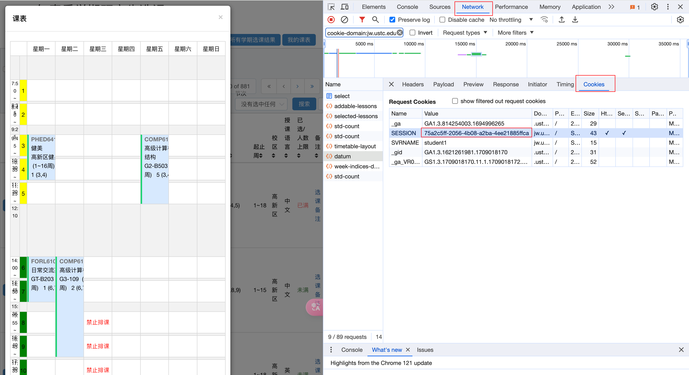
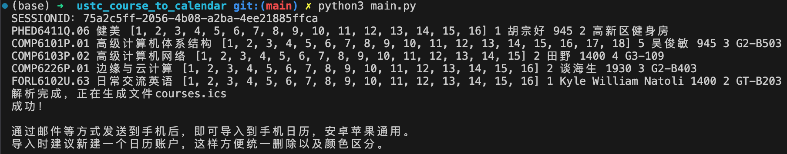
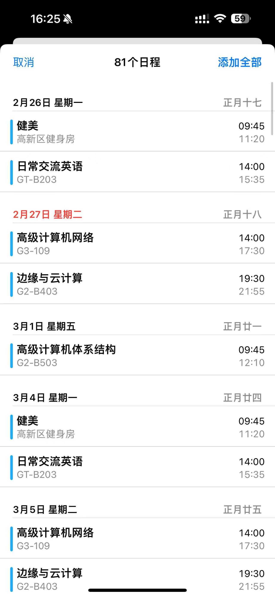
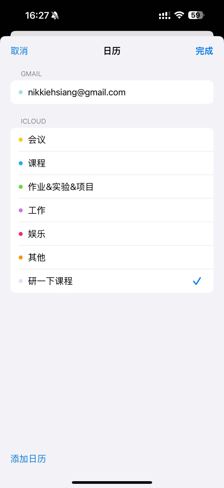

# 简介

根据教务网jw.ustc.edu.cn上的课表信息，声称对应的 .ics文件（[iCalendar](https://baike.baidu.com/item/iCal/10119576), “日历数据交换”的标准），适用于Android和iOS。

# 使用方式

## step1

执行

```
python3 main.py
```

## step2

1. 执行完毕，要求输入SESSIONID:
2. 进入教务网，打开自己的课表
3. 打开浏览器的开发者工具，点击Network-->Cookies，找到SESSION字段，此值即为需要输入的SESSIONID（如下图红框所示）



## Step3

执行完毕后，命令行会输出本学期所选课的信息（本脚本默认为USTC2024春、夏学期）



新生成了文件courses.ics

## step4

为了防止出错，请新添加一个日历

打开系统日历，点击下方“日历"


点击左下方“添加日历"


这个新建的日历就是稍后导入.ics的日历

## step5

用邮箱等方式发送到你的手机

iOS：

将.ics作为附件发送到手机iCloud邮箱（如果没有iCloud邮箱请到“设置"-->顶部iCloud-->"iCloud"-->"iCloud邮件"新建），用系统自带的邮件打开iCloud邮箱，打开附件。



点击右上方添加全部，选择刚刚新建的日历，导入即可。


